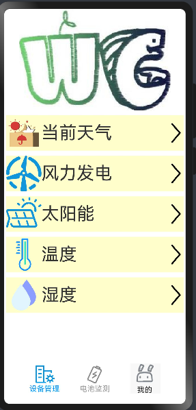

# #星计划#梅科尔工作室HOS-基于鸿蒙运维的园区智慧微电网
# 前言
我们项目主要是为了实现对环境温度、湿度、风力等数据的实时获取，并且可以实时获取硬件端测试的发电量，电池电压、电流，等数据实时监控电池的健康状况。作为一个刚入门的开发者，在鸿蒙开发的过程中确实遇到了很多困难。这些困难主要是在于如何将一些后端的数据和前端APP联系起来，让他查看起来美观清晰，简单明了。我们根据官方提供的全面资料，自己不断的尝试与调整，最终也是有了初步的结果。
# 运行环境
DevEco Studio版本：DevEco Studio 3.1.1 Release及以上版本。

鸿蒙 SDK版本：API 9， 鸿蒙 3.2 Release。

# 前期准备
## 1.1软件安装与环境搭建
这一部分的内容在官方资料文档里有着十分清晰的讲解，并且鸿蒙本身的安装难度并不高，所以这里就不多说了，如果有问题可以联系我们。

## 1.2创建项目
创建新项目时，点击File按钮，在弹出的列表里点击New，然后创建New Project。输入自己的项目名和文件存放位置，本项目采用的ArkTS语言进行开发。

  

## 1.3真机签名
为了进行程序在DAYU200上的调试与开发，首先需要进行真机签名，可以通过DevEco Studio来进行自动签名

# 主要功能
## 2.1 登录
我们打开应用之后首先就是登录界面，能够实现账号登陆、账号注册及其他登录方式。登录界面主要由文本、文本框、按钮以及一些为了美观的图片组成。

    Image($r("app.media.tupian"))
      .width(240)
      .height(160)  
    Text('登陆界面')
      .fontSize(40)
      .fontweight(Fontweight.Medium)
      .height(80)
    Text('登陆账号以使用更多服务')
      .fontSize(18)
      .fontWeight(FontWeight.Regular)
      .height(50)
    TextInput({placeholder:'账号'})
      .maxLength(11)
      .type(InputType.Number)
      .height(50)
    TextInput({placeholder:'密码'})
      .maxLength(11)
      .type(InputType.Password)
      .height(50)
      .onChange((value: string)=>{
        this.account = value;
      })

在忘记密码时可以选用方便的短信登录或者重置密码，没有账号也可以选择注册账号。

    Row() {
      Text('短信验证码登陆')
        .fontSize(15).fontColor(0x317aff)
      Text('忘记密码')
        .fontSize(15).fontColor(0x317aff)
    }.width('100%').justifyContent(FlexAlign.SpaceBetween)
    Text('Circle button').fontSize(9).fontColor(0xFFFFFF)
    Button('登陆',{type: ButtonType.Capsule}).height(50).width(100).fontSize(20)
      .onClick(() =>{router.push({ url:"pages/tabsdemo" })})
    Button('注册账号',{type: ButtonType.Capsule}).height(50).width(100)
      .backgroundColor(0xFFFFFF).fontColor(0x317aff)

或者是使用其他的方式去进行登录。

    Text('其他登陆方式').fontColor(0xCCCCCC).height(50)
    Row() {
      Button('微信',{type: ButtonType.Circle})
        .backgroundColor(0x00CC33).height(70)
      Button('QQ',{type: ButtonType.Circle})
        .backgroundColor(0x33CCFF).height(70)
      Button('邮箱',{type: ButtonType.Circle})
        .backgroundColor(0xFFFF33).height(70).fontColor(0x317aff)
    }.width('100%').justifyContent(FlexAlign.SpaceEvenly)

## 2.2发电设备全生命周期监测
这部分代码我们通过Text、Image等基本小组件保证整体界面的美观性，并且通过Onclick等组件触发，使用户可以选择自己想要具体查看的数据。

    Column({space:10}){
      Image($r("app.media.tupian")).width(300).height(200)}

显示天气的文字与图片，并且让其点击之后可以跳转到相关界面

    Row(){
        Image('/common/images/image1/tianqi.png').height(60).width(60)
        Text(' 当前天气').fontSize(35).width('70%')
          .onClick(() =>{router.push({ url:"pages/shebei/tianqi1" })})
        Image('/common/images/yjt.png').height(60).width(60)
          .onClick(() =>{router.push({ url:"pages/shebei/tianqi1" })})
      }.backgroundColor('#CDFFCD').width('100%')

显示风力发电的文字与图片，并且让其点击之后可以跳转到相关界面

    Row(){
        Image('/common/images/image1/fengli.png').height(60).width(60)
        Text(' 风力发电').fontSize(35).width('70%')
          .onClick(() =>{router.push({ url:"pages/shebei/fengli" })})
        Image('/common/images/yjt.png').height(60).width(60)
          .onClick(() =>{router.push({ url:"pages/shebei/fengli" })})
      }.backgroundColor('#CDFFCD').width('100%')

显示太阳能发电的文字与图片，并且让其点击之后可以跳转到相关界面

    Row(){
        Image('/common/images/image1/tyn.png').height(60).width(60)
        Text(' 太阳能').fontSize(35).width('70%')
          .onClick(() =>{router.push({ url:"pages/shebei/tyn" })})
        Image('/common/images/yjt.png').height(60).width(60)
          .onClick(() =>{router.push({ url:"pages/shebei/tyn" })})
      }.backgroundColor('#CDFFCD').width('100%')

显示环境温度的文字与图片，并且让其点击之后可以跳转到相关界面

    Row(){
        Image('/common/images/image1/wendu.png').height(60).width(60)
        Text(' 温度').fontSize(35).width('70%')
          .onClick(() =>{router.push({ url:"pages/shebei/wendu" })})
        Image('/common/images/yjt.png').height(60).width(60)
          .onClick(() =>{router.push({ url:"pages/shebei/wendu" })})
      }.backgroundColor('#CDFFCD').width('100%')

显示环境温度的文字与图片，并且让其点击之后可以跳转到相关界面

    Row(){
        Image('/common/images/image1/shidu.png').height(60).width(60)
        Text(' 湿度').fontSize(35).width('70%')
          .onClick(() =>{router.push({ url:"pages/shebei/shidu" })})
        Image('/common/images/yjt.png').height(60).width(60)
          .onClick(() =>{router.push({ url:"pages/shebei/shidu" })})
      }.backgroundColor('#CDFFCD').width('100%')

 

## 2.3电量预测
关于整体界面的代码和上面发电设备的代码形式基本一致，就不在重复展示了，只展示一下这个界面的效果，以及点击进去之后的理想效果。

 

 

 

## 2.4主体界面展示
我们通过toolbar和tabs组件，使其可够实现页面跳转，滑动翻页，保证三个主要页面的正常使用与区分。这一块由于有些复杂，导致一些代码有些长，看起来有点凌乱。

    struct Tabsdemo {
      @State currentIndex: number = 0
      @Builder TabBuilder0(index: number){
        Column(){
          Image(this.currentIndex === index?'/common/images/shebei1.png':'/common/images/shebei.png')
            .width(40).height(40)
          Text('设备管理').fontColor(this.currentIndex === index ? '#4FB6C8': '#838383')
          .fontSize(15)
        }.width('100%')
      }
      @Builder TabBuilder1(index: number){
        Column(){
          Image(this.currentIndex === index?'/common/images/dianchi1.png':'/common/images/dianchi.png')
            .width(40).height(40)
          Text('电池监测').fontColor(this.currentIndex === index ? '#4FB6C8':'#838383')
          .fontSize(15)
        }.width('100%')
      }
      @Builder TabBuilder2(index: number){
        Column(){
          Image(this.currentIndex===index?'/common/images/wode1.png':'/common/images/wode.png')
            .width(55).height(55)
        }.width('100%')
      }
    }

在我们前面的代码也有些展示，我们通过onclick组件与router.push组合使用，通过点按实现具体界面的切换，例如：

    Text(' 当前天气').fontSize(35).width('70%')
      .onClick(() =>{router.push({ url:"pages/shebei/tianqi1" })})

我们界面的切换基本就是采用这种形式。

    

# 展望
随着时代的进步，电子信息技术不断发展，互联网行业也需要不断前进。而鸿蒙作为一款新兴的操作系统，注重分布式能力，使得设备之间能够更好地协同工作，共享资源，提升整体系统性能。这些为开发者提供了更灵活的方式，使得开发者越来越多的开始接触鸿蒙操作系统，鸿蒙也将成为未来科技市场的重要组成部分。

在这个过程中我们也将要不断的学习进步，向外交流以适应现在这个充满创新的时代。

